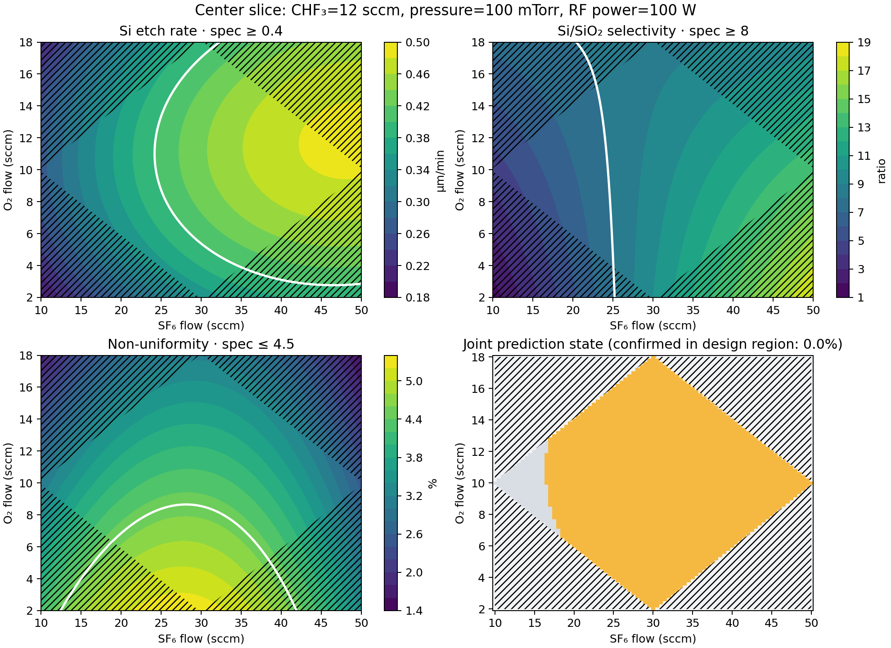
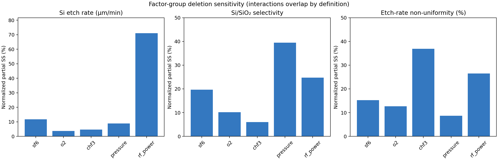
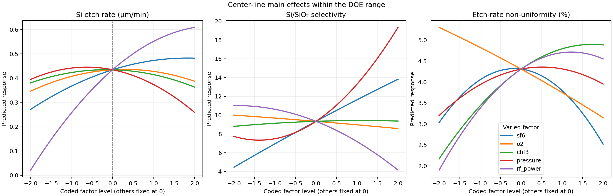

# Etch Process Window Studio

식각 공정에서 식각 속도만 높이면 선택비와 균일도가 무너진다. 그래서 이 프로젝트는 세 응답을 동시에 만족하는 조건 범위, 곧 공정 윈도우를 실험 범위 안에서 판정하는 도구를 목표로 삼았다. 실제 장비 데이터는 공개할 수 없어 공개된 silicon RIE 논문의 32-run 실험계획(DOE)을 직접 전사했고, 그 데이터로 21항 반응표면모형(RSM)을 재구성해 논문 계수와 대조한 뒤, 사용자가 입력한 성능 기준을 동시에 만족하는 영역을 탐색하도록 만들었다.

결과는 다음과 같다. 식각 속도 R² 0.9901, 선택비 R² 0.8876으로 논문 값과 비슷했지만, 잔차표준오차와 계수 18개가 논문과 달라 완전한 재현으로 판정하지 않았다. 데모 기준에서 평균예측만으로 기준을 충족한 격자는 46.4%였으나 95% 예측구간까지 통과한 확정 격자는 0개였다. 평균만 보면 절반 가까이 통과하지만 불확실성을 반영하면 확신할 수 있는 조건이 남지 않는다는 사실을 이 도구로 확인했다.

이 저장소는 논문 재현 검증과 공정 윈도우 탐색 도구를 다루며, 양산 레시피를 추천하거나 논문 결과를 완전히 복원했다고 주장하지 않는다.

## 프로젝트 요약

| 항목 | 내용 |
|---|---|
| 문제 | 식각 속도, 선택비, 비균일도를 동시에 만족하는 공정 영역 판정 |
| 데이터 | Legtenberg et al. (1995) SF₆/O₂/CHF₃ RIE, 32-run 중앙합성설계(CCD) |
| 인자 | SF₆, O₂, CHF₃, pressure, RF power 5개 (coded −2~+2) |
| 모델 | 21항 full-quadratic OLS (절편 1 + 선형 5 + 제곱 5 + interaction 10) |
| 주요 응답 | Si etch rate, Si/SiO₂ selectivity, etch-rate non-uniformity |
| 보조 응답 | anisotropy(전사 불일치), DC bias(감사용) |
| 주요 기능 | 논문 계수 감사, ANOVA, 요인 그룹 민감도, 95% 예측구간, 3단계 공정 윈도우 판정, Streamlit UI |
| 검증 | 단위 테스트와 UI 테스트 함수 44개, parametrize 전개 후 `47 passed` |
| 적용 범위 | 논문 장비와 DOE 범위 안의 탐색적 분석. 양산 조건 추천 아님 |
| 저장소 운영 | 공개 저장소로 운영. 원문 PDF는 저작권상 제외 |

## 1. 문제 정의

식각 공정에서 "식각 속도가 가장 높은 조건"은 실제로 쓸 수 있는 조건이 아니다. 실리콘이 빠르게 깎여도 SiO₂ 마스크가 함께 깎이면 선택비(selectivity)가 떨어져 패턴이 무너지고, 웨이퍼 안에서 식각 깊이가 고르지 않으면 비균일도(non-uniformity) 때문에 일부 다이만 쓸 수 있다. 그래서 이 프로젝트는 단일 최댓값 탐색이 아니라 세 조건을 동시에 만족하는 영역(process window)을 찾는 문제로 정의했다.

실제 장비 데이터는 공개하기 어렵기 때문에 공개 논문의 DOE를 사용했다. 다만 서로 다른 논문의 실험값을 합치면 장비, chamber, 계측 방식 차이가 섞여 근거가 약해지므로, 완전한 데이터를 가진 한 편만 사용하고 부족한 표를 결합하지 않았다.

## 2. 데이터 선정과 감사

### 후보 3편 검토

가이드라인의 "3편 이상 탐색하지 않는다" 규칙에 따라 세 편을 검토하고 한 편만 채택했다.

| 논문 | 판정 | 사유 |
|---|---|---|
| Legtenberg et al. (1995) | 채택 | 5인자의 실제 수준과 coded 수준, 32-run 실측 응답, 21개 회귀계수와 R²가 모두 공개 |
| Muttalib et al. (2017) | 탈락 | ANOVA와 회귀계수 없음. Table 2의 pressure 열이 gas ratio와 결합되어 L9 직교성 없음. Table 4 평균이 인쇄값으로 재현되지 않음 |
| Tipton et al. (1993) | 탈락 | 20-run 회귀계수는 있으나 run별 실측 응답표가 본문에 없어 독립 재현 불가 |

부족한 논문을 예비로 채우면 재현보다 추정이 많아지므로 채택 기준을 낮추지 않았다.

### 인자 수준

| 인자 | −2 | −1 | 0 | +1 | +2 |
|---|---:|---:|---:|---:|---:|
| SF₆ (sccm) | 10 | 20 | 30 | 40 | 50 |
| O₂ (sccm) | 2 | 6 | 10 | 14 | 18 |
| CHF₃ (sccm) | 2 | 7 | 12 | 17 | 22 |
| Pressure (mTorr) | 20 | 60 | 100 | 140 | 180 |
| RF power (W) | 20 | 60 | 100 | 140 | 180 |

32개 run 중 중심점 6회 반복이 포함되어 순수오차(pure error)를 추정할 수 있다.

### 전사 원칙

원문 PDF의 SHA-256, DOI, 다운로드 URL을 [`data/source_manifest.json`](data/source_manifest.json)에 기록했고, `scripts/validate_acquisition.py`가 32행 설계, coded-to-actual 매핑, 중심점 6회를 자동으로 검증한다.

전사하면서 지킨 원칙은 세 가지다. synthetic response는 만들지 않았다. 그래프는 매끄러워지지만 논문과 대조할 근거가 사라지기 때문이다. 논문 계수와 다른 값도 임의로 고치지 않았다. 원저자의 정정 공지가 없으므로 차이를 감사 산출물로 보존했다. 논문의 별표(outward-sloped profile)는 `anisotropy_outward_slope` 열로 따로 보존했다.

## 3. 모델과 공정 윈도우 설계

### 21항 RSM

논문과 같은 coded factor 순서(SF₆, O₂, CHF₃, pressure, RF power)로 full-quadratic OLS를 구현했다.

| 구성 | 개수 |
|---|---:|
| 절편 | 1 |
| 선형항 | 5 |
| 제곱항 | 5 |
| interaction 항 | 10 |
| 합계 | 21 |

설계행렬은 32×21이고 rank 21, 잔차 자유도 11이다. 중심점 6회 반복이 있으므로 잔차 제곱합을 순수오차(df 5)와 적합결여(lack-of-fit, df 6)로 분리했다.

### 공정 윈도우 3단계 판정

각 격자점에서 세 응답의 평균예측과 95% 점별(pointwise) 예측구간을 산출한 뒤 다음 순서로 판정한다.

1. 설계 지지영역 검사. 인자별 범위만 보지 않고 CCD 점들의 볼록껍질(convex hull) 안에 있는지, 관측 레버리지 한계 안에 있는지 함께 확인한다. 각 인자가 개별 범위 안에 있어도 다차원 조합이 설계에서 지지되지 않으면 판정에서 제외한다.
2. 확정(confirmed). 예측구간 전체가 세 기준을 통과하고 설계 지지영역 안에 있는 점.
3. 불확실(uncertain). 예측구간이 기준 경계와 겹쳐 확정도 탈락도 아닌 점. 평균예측이 기준을 넘는지와는 별개로 판정한다.
4. 탈락(rejected). 적어도 한 응답에서 예측구간 전체가 기준을 벗어나는 점.

두 종류의 제한은 서로 다르게 동작한다. 인자별 DOE 범위를 벗어난 입력은 좌표 변환 단계에서 `ValueError`로 거부되어 예측이 아예 계산되지 않는다([`design.py:actual_to_coded`](src/etch_window/design.py)). 반면 볼록껍질과 레버리지 검사는 격자 전체를 계산한 뒤 사후 마스킹으로 적용한다([`window.py`](src/etch_window/window.py)). 확정률과 종합 판정 패널은 마스킹 이후 값이지만, 평균예측 충족률과 응답별 contour는 전체 격자 값이다. 지지영역 밖은 그림에서 사선으로만 표시한다.

수치 코어는 [`src/etch_window/`](src/etch_window)에 있고 UI와 분리했다.

## 4. 핵심 결과

### 모델 적합

| 응답 | R² | adjusted R² | 잔차표준오차 | 논문 R² | 판정 |
|---|---:|---:|---:|---:|---|
| Si etch rate | 0.9901 | 0.9720 | 0.0260 | 0.99 | 주 모델 |
| Si/SiO₂ selectivity | 0.8876 | 0.6832 | 2.7908 | 0.90 | 주 모델 |
| Non-uniformity | 0.6958 | 0.1428 | 1.6445 | — | 탐색 모델 |
| Anisotropy | 0.8371 | 0.5410 | 0.0995 | 0.95 | 보조(전사 불일치) |
| DC bias | 0.9931 | 0.9805 | 20.6847 | 0.99 | 감사용 |

비균일도는 32개 표본에 21개 항을 사용해 adjusted R²가 0.1428까지 떨어지고, 전체 모델 F 검정도 p = 0.356으로 유의하지 않다. 그래서 이 응답은 예측 모델이 아니라 탐색 모델로만 취급했다.

### 요인 그룹 민감도

| 응답 | 최대 기여 인자 | 정규화 부분 제곱합 | 해당 인자 p-value |
|---|---|---:|---:|
| Si etch rate | RF power | 71.1% | 8.1×10⁻¹⁰ |
| Si/SiO₂ selectivity | Pressure | 39.4% | 0.0021 |
| Non-uniformity | CHF₃ | 36.9% | 0.111 |

이 값은 각 요인에 속한 선형항, 제곱항, interaction 항을 full model에서 함께 제거했을 때 늘어나는 부분 제곱합을 다섯 요인 그룹의 부분 제곱합 합계로 나눈 비율이다. 그래서 합은 100%가 되지만, interaction 항이 두 요인 그룹에 동시에 포함되므로 총변동을 나누어 갖는 가산형 ANOVA 기여율과는 다르고 상대 순위로만 읽어야 한다. 특히 비균일도의 CHF₃는 기여율 순위만 1위일 뿐 p-value가 0.111이고 모델 전체도 유의하지 않으므로, 지배 인자로 판정하지 않았다.

### 데모 공정 윈도우

고정값 CHF₃ 12 sccm, pressure 100 mTorr, RF power 100 W에서 SF₆ 10–50 sccm과 O₂ 2–18 sccm을 81×81 격자로 탐색한 결과다.

| 항목 | 결과 |
|---|---:|
| 평균예측 충족률 | 46.4% |
| 설계 지지영역 비율 | 50.0% |
| 95% 예측구간 확정률 | 0.0% |
| 테스트 결과 | 47 passed |

6,561개 격자 중 3,042개(46.4%)가 평균예측만으로는 세 기준을 만족했다. 이 수는 설계 지지영역 마스킹 전의 전체 격자 기준이다. 3,281개(50.0%)는 CCD 볼록껍질과 레버리지 한계 안에 있었는데, 이 비율은 성능 지표가 아니라 예측을 허용해도 되는 범위의 크기다. 그런데 두 조건을 모두 만족하면서 95% 예측구간까지 통과한 격자는 0개였다. 평균만 보면 절반 가까이 통과하지만, 불확실성을 반영하면 확신할 수 있는 조건이 남지 않는다는 뜻이다.

예시 기준(etch rate ≥ 0.4 µm/min, selectivity ≥ 8, non-uniformity ≤ 4.5%)은 소프트웨어가 잘 작동하는지 확인할 데모 기준이며 논문 값도, 양산 승인 기준도 아니다. [`data/processed/phase_b_summary.json`](data/processed/phase_b_summary.json)에 `"source": "demonstration_only_not_from_paper"`로 기록해 두었다.

## 5. 논문과 일치하지 않은 결과

이 프로젝트에서 가장 중요한 산출물은 높은 R²가 아니라, 논문과 맞지 않은 부분을 고치지 않고 그대로 남긴 대조 기록이다.

### 계수 불일치 18개

반올림 허용오차를 벗어난 계수는 총 18개이고, 응답별 분포는 다음과 같다.

| 응답 | 불일치 항 수 |
|---|---:|
| Anisotropy | 14 |
| Si etch rate | 2 |
| Si/SiO₂ selectivity | 1 |
| DC bias | 1 |
| 합계 | 18 |

anisotropy를 제외한 4개 항의 상세는 다음과 같다.

| 응답 | 항 | 적합값 | 논문값 | 성격 |
|---|---|---:|---:|---|
| Si etch rate | `b3` (CHF₃ 선형) | −0.0044 | +0.004 | 크기 유사, 부호 반대 |
| Si etch rate | `b4` (pressure 선형) | −0.0340 | −0.0430 | 부호 동일, 절댓값 약 21% 작음 |
| Si/SiO₂ selectivity | `b3` (CHF₃ 선형) | +0.1417 | −0.14 | 크기 유사, 부호 반대 |
| DC bias | `b34` (CHF₃×pressure) | −6.5625 | +7.0 | 크기 유사, 부호 반대 |

부호가 반대인 세 항은 인쇄 오류일 가능성이 있지만 원저자 정정 공지가 없으므로 확정하지 않았다. anisotropy는 별표 행을 `2−A`로 변환하는 해석과 제외하는 해석을 모두 시험했으나 논문 표를 복원하지 못했다.

제외 해석은 애초에 항별 대조가 성립하지 않는다. 별표가 붙은 8개 run(3, 9, 11, 15, 17, 20, 21, 24)을 빼면 설계행렬이 24×21이지만 rank가 19로 떨어진다. 이때 `np.linalg.lstsq`는 여전히 답을 내지만 그것은 똑같이 잘 맞는 무한히 많은 해 중 최소노름 해 하나일 뿐이므로, 21개 항 중 15개는 개별적으로 식별되지 않는다. 개별 대조가 가능한 항은 `b0`, `b1`, `b5`, `b11`, `b55`, `b15` 6개뿐이다. [`scripts/audit_paper_coefficients.py`](scripts/audit_paper_coefficients.py)가 이 rank 부족을 경고로 출력하고 식별 불가능한 항에 `[not identifiable]`을 표시하며, 이 동작은 [`tests/test_audit_paper_coefficients.py`](tests/test_audit_paper_coefficients.py)로 고정했다.

### 잔차표준오차 불일치

| 응답 | 적합 잔차 s | 논문 s | 배율 |
|---|---:|---:|---:|
| Si etch rate | 0.0260 | 0.01 | 2.6배 |
| Si/SiO₂ selectivity | 2.7908 | 0.5 | 5.6배 |

R²가 논문 값과 비슷해도 같은 모델을 재현했다고 볼 수 없다. R²는 총변동 대비 설명된 비율이므로 잔차의 절대 크기가 달라도 비슷하게 나올 수 있기 때문이다. 식각 속도는 R² 0.9901로 논문 0.99와 거의 같지만 잔차표준오차, 곧 모델이 설명하지 못한 오차의 크기는 2.6배이고 선택비는 5.6배 크다. 인자 순서, coding 식, 설계행렬 rank, 제곱항과 interaction 항 순서, 전사값을 차례로 점검했으나 차이가 남았고, 원자료를 수정하지 않고 감사 이슈로 보존했다.

### 적합결여(lack-of-fit) 검정

중심점 6회 반복으로 순수오차를 분리한 결과다.

| 응답 | LOF F | p-value | 판정 |
|---|---:|---:|---|
| Si etch rate | 11.98 | 0.0077 | 적합결여 유의 |
| Si/SiO₂ selectivity | 71.04 | 0.0001 | 적합결여 유의 |
| Non-uniformity | 1.60 | 0.312 | 유의하지 않음 |

주 응답 두 개에서 적합결여가 유의하다. 2차 모형이 중심점 반복이 보여 주는 실험 재현성 수준까지는 설명하지 못한다는 뜻이며, 예측구간을 넓게 잡아야 할 근거이자 §4의 확정률 0%를 뒷받침하는 결과다. 수치는 [`data/processed/anova_lack_of_fit.csv`](data/processed/anova_lack_of_fit.csv)에 있다.

## 6. 시각적 결과

### 공정 윈도우 판정



세 응답의 contour와 종합 판정을 한 화면에 표시한다. 흰 실선은 각 응답의 데모 기준 경계이고, 사선 빗금은 설계 지지영역 밖이라 확정 판정에서 제외한 구역이다. 이 구역도 예측값은 계산되고 평균예측 충족률에는 포함되지만, 확정 판정에는 넣지 않는다. 우하단 종합 패널의 초록, 주황, 회색은 모두 설계 지지영역 안쪽이며 각각 확정, 불확실, 탈락을 뜻한다. 지지영역 3,281개 중 199개가 회색(탈락)이고, 제목의 `confirmed in design region: 0.0%`가 95% 예측구간까지 통과한 격자가 없음을 보여 준다.

이 그림은 CHF₃ 12 sccm, pressure 100 mTorr, RF power 100 W로 고정한 하나의 2차원 단면이므로 다른 고정값에서는 모양이 달라진다. 기준값이 데모용이므로 색이 진한 영역을 그대로 공정 조건으로 옮겨서는 안 되고, 확정 격자가 0개이므로 양산 레시피 후보로도 사용할 수 없다.

### 요인 그룹 민감도



각 요인 그룹을 full model에서 제거했을 때 늘어나는 부분 제곱합을 정규화한 값이다. 식각 속도는 RF power, 선택비는 pressure, 비균일도는 CHF₃가 가장 크다.

막대는 다섯 요인 그룹의 부분 제곱합 합계에 대한 비율이라 합이 100%이고, interaction 항이 두 그룹에 중복 계산되므로 총변동 대비 가산형 기여율이 아니다. 통계적 유의성과 순위는 별개여서 비균일도의 CHF₃는 p = 0.111로 강한 증거가 아니다. 그래서 이 그림은 어떤 인자를 먼저 확인할지 정하는 우선순위 참고 자료이지 인과관계의 증거가 아니다.

### 중심선 main effect



나머지 네 인자를 중심점(coded 0)에 고정하고 한 인자만 −2에서 +2까지 변화시킨 예측 곡선이다. RF power가 식각 속도를 크게 끌어올리면서 선택비는 낮추는 절충, O₂가 늘수록 비균일도가 줄어드는 경향을 한눈에 볼 수 있다.

곡선은 coded −2~+2 범위 안에서만 유효하며 축을 연장한 외삽은 코드에서 차단된다. 다른 인자를 중심점이 아닌 값에 고정하면 곡선 모양이 바뀌므로 이 그림 하나로 인자별 최적값을 결정할 수 없다. 논문이 제시한 플라즈마 화학 설명과 방향은 일치하지만, 이 분석만으로 새로운 인과관계를 증명한 것은 아니다.

## 7. Streamlit UI

수치 코어를 변경하지 않고 화면 계층만 연결했다. UI는 계산을 다시 정의하지 않고 [`src/etch_window/`](src/etch_window)의 같은 함수를 호출한다.

| 탭 | 기능 |
|---|---|
| Process window | 세 가지 사용자 입력 기준(etch rate 최소, selectivity 최소, non-uniformity 최대) 입력, 탐색축 2개 선택, 나머지 세 인자 고정값 slider 조정, 평균예측과 95% 예측구간 기반 3단계 판정, 충족 격자 CSV 다운로드 |
| 논문 재현 대조 | 응답별 R², adjusted R², 잔차표준오차와 논문 R² 비교, 21개 항의 적합 계수, 논문 계수, 차이, 허용오차 판정 |
| ANOVA · Main effect | 요인 그룹 삭제 기반 정규화 부분 제곱합, 중심선 main-effect 곡선, 항별 부분 F 검정과 p-value |
| 데이터 · 한계 | 논문 서지사항, 5개 인자의 실제 단위 범위, 32행 전사 DOE, 그리고 비균일도의 낮은 adjusted R², anisotropy 전사 불일치, 데모 기준의 비생산 성격을 명시한 한계 설명 |

인자별 DOE 범위 밖 값은 slider가 애초에 만들 수 없고, 범위 안이지만 설계가 지지하지 않는 조합은 계산 후 판정에서 제외된다. 따라서 DOE 범위 밖 예측이 결과로 제시되지 않는다.

## 8. 검증과 재현 방법

```powershell
cd etch-process-window-studio
python -m venv .venv
.\.venv\Scripts\python.exe -m pip install -e ".[test]"
$env:PYTHONPATH = "src"

# 1. 데이터 확보 검증 (32행 설계, coded-to-actual 매핑, 중심점 6회)
.\.venv\Scripts\python.exe scripts\validate_acquisition.py

# 2. Phase B 산출물 재생성 (계수, 지표, ANOVA, 민감도, 공정 윈도우, 그림)
.\.venv\Scripts\python.exe scripts\run_phase_b.py

# 3. 단위 테스트와 UI 테스트
.\.venv\Scripts\python.exe -m pytest -q

# 4. Streamlit 실행
.\.venv\Scripts\python.exe -m streamlit run app.py
```

원문 PDF 없이도 위 검증이 모두 실행된다. PDF는 저작권과 저장소 용량을 고려해 포함하지 않았고, 기본 검증은 공개 CSV, 설계 매핑, 출처 manifest만 확인한다. manifest의 URL에서 PDF를 직접 받아 지정 경로에 두면 SHA-256까지 대조할 수 있다.

```powershell
.\.venv\Scripts\python.exe scripts\validate_acquisition.py --require-pdfs
```

2번은 1번과 4번 사이에서 건너뛸 수 없다. 앱의 "Process window" 탭은 원자료를 매번 다시 적합하지만, "논문 재현 대조" 탭과 "ANOVA" 탭은 2번이 만든 CSV를 읽는다. 두 경로가 서로 다른 버전을 보여 주지 않도록 `run_phase_b.py`가 자기 입력(원자료 CSV 2개, 수치 코어 모듈 5개, 스크립트 자신)의 SHA-256을 `phase_b_summary.json`에 기록하고, 앱은 시작할 때 이를 대조해 어긋나면 어떤 탭도 그리지 않고 멈춘다. 구현은 [`src/etch_window/provenance.py`](src/etch_window/provenance.py)에 있다.

수치 코어(위 5개 모듈이나 `run_phase_b.py` 자신)를 고쳤다면 2번(`run_phase_b.py`)을 다시 돌린 뒤 3번(`pytest`)을 실행한다. 재빌드를 건너뛰면 이 SHA-256이 어긋나 provenance 테스트 4개가 실패하는데, 그중 3개는 실패 메시지만으로는 원인이 digest 불일치라는 사실을 알기 어렵다. 그래서 이 실패를 보면 먼저 재빌드 여부부터 확인한다.

논문 계수 대조만 따로 실행하려면 `scripts\audit_paper_coefficients.py`를 사용한다. 이 스크립트는 outward-slope 8개 run을 제외한 anisotropy 설계가 rank 부족(19/21)임을 경고로 출력하고, 개별 식별이 불가능한 15개 항에 `[not identifiable]`을 표시한다(§5 참조).

## 9. 저장소 구조와 상세 문서

```text
etch-process-window-studio/
├── app.py                          # Streamlit UI (Phase C)
├── data/
│   ├── raw/                        # 논문 전사 DOE 32행, 논문 계수, 탈락 논문 감사표
│   ├── processed/                  # 계수, 지표, ANOVA, 민감도, 공정 윈도우 격자, 요약 JSON
│   └── source_manifest.json        # 출처, DOI, PDF SHA-256, 채택/탈락 상태
├── papers/                         # 원문 PDF (저작권상 저장소에서 제외)
├── scripts/
│   ├── validate_acquisition.py     # 설계, 매핑, 중심점, 해시 검증
│   ├── audit_paper_coefficients.py # 논문 Table 4.4 항별 대조, rank 부족 경고
│   └── run_phase_b.py              # Phase B 산출물 일괄 생성
├── src/etch_window/
│   ├── data_access.py              # 원자료 로딩과 응답 매핑(RESPONSE_COLUMNS) 단일 정의
│   ├── design.py                   # 설계행렬, coded-to-actual 변환
│   ├── rsm.py                      # 21항 OLS, 레버리지, 예측구간
│   ├── anova.py                    # 전체 ANOVA, 부분 제곱합, lack-of-fit
│   ├── window.py                   # 공정 윈도우 판정, 볼록껍질과 레버리지 마스크
│   ├── provenance.py               # 사전 계산 표와 입력의 SHA-256 대조
│   └── ui_support.py               # UI용 표와 그림 생성
├── tests/                          # 단위 테스트와 UI 테스트 함수 44개 (47 passed)
└── reports/                        # 단계별 검증 보고서와 그림
```

### 상세 문서

| 문서 | 내용 |
|---|---|
| [`reports/PHASE_A_DATA_ACQUISITION.md`](reports/PHASE_A_DATA_ACQUISITION.md) | 후보 3편 검토, 채택과 탈락 근거, 전사 검증, 계수 사전 감사 |
| [`reports/PHASE_B_NUMERICAL_CORE.md`](reports/PHASE_B_NUMERICAL_CORE.md) | 21항 RSM 적합, 논문 대조, ANOVA와 민감도, 데모 공정 윈도우 |
| [`reports/PHASE_C_UI_REVISED_2026-08-04.md`](reports/PHASE_C_UI_REVISED_2026-08-04.md) | Streamlit UI 기능과 실제 브라우저 검증. 테스트 개수를 15개로 정합화한 수정본 |

테스트 개수의 기준 문서는 이 README다. 단계별 보고서는 작성 시점의 기록이므로 그 시점 값을 그대로 둔다. 이력은 다음과 같다.

| 시점 | 개수 | 비고 |
|---|---:|---|
| `reports/PHASE_C_UI.md` 원본 | 14 | 완료 기준 표에 남은 오래된 값 |
| `reports/PHASE_C_UI_REVISED_2026-08-04.md` | 15 | 실제 수집 수에 맞춰 정합화 |
| 2026-08-14 (M-7 수정) | 16 | 응답 패널별 spec 경계 검증 추가 |
| 2026-08-16 (2026-08-13 리뷰 잔여 항목) | 함수 37개 / `39 passed` | provenance, rank, PI 폭, `-O` 검증 추가 |
| 2026-08-16 (코드 리뷰 후속 수정) | 함수 44개 / `47 passed` | feasible과 supported_confidence_state 뮤테이션 테스트, data_access.py 드리프트 회귀 추가 |

표의 마지막 줄에서 두 수가 갈리는 이유는 `tests/test_provenance.py`의 한 테스트가 `parametrize`로 4회 실행되기 때문이다. `def test_` 함수 수는 44개, pytest 실행 수는 47개이며 둘 다 맞는 값이다.

## 10. 한계와 후속 과제

### 한계

- 단일 논문의 32개 실험만 사용했으므로 독립 데이터셋 검증이 아니다.
- 논문 장비와 실제 적용 장비가 다르다. chamber 상태, wafer loading, mask 구조, 온도, 계측 방식이 반영되지 않았다.
- 장비 drift와 lot 간 변동이 데이터에 없다.
- 비균일도 모델은 adjusted R² 0.1428, 전체 모델 p = 0.356으로 예측력이 약하다.
- 주 응답 두 개에서 적합결여가 유의하다(§5). 2차 모형이 실험 재현성 수준까지 설명하지 못한다.
- 예측구간은 점별(pointwise) 95% 구간이며 격자 전체에 대한 동시 신뢰구간이 아니다. 여러 점을 동시에 판단하면 실제 신뢰수준은 95%보다 낮다.
- DOE 범위 밖 외삽은 코드에서 금지된다. 볼록껍질과 레버리지 한계 밖 조합도 마찬가지다.
- 논문 계수 불일치 18개의 원인이 확정되지 않았다.

### 후속 과제

새로운 수치를 만들어 내는 확장이 아니라, 위 한계를 실제로 줄이는 작업만 나열한다.

1. 대상 장비 확인 실험. 데모 기준 대신 실제 요구 기준을 넣고, 예측구간이 넓은 조건 중 일부를 실제 장비에서 측정해 모델과 대조한다.
2. 재보정. 확인 실험 결과로 절편과 주요 계수를 재적합하고, 장비별 offset이 필요한지 판단한다.
3. 비균일도 모델 축소. 21항 전체 대신 유의한 항만 남긴 축소 모델과 현재 모델의 예측구간 폭을 비교한다.
4. 동시 신뢰구간 도입. 점별 구간을 Bonferroni 또는 Scheffé 기반 동시 구간으로 바꿨을 때 확정 영역이 어떻게 변하는지 확인한다.
5. 외부 논문 교차 검증. 동일 가스계의 다른 공개 DOE가 확보되면 결합하지 말고 별도 모델로 적합해 방향성만 비교한다.
6. 운영 검증. 실제 사용 시 입력 기준 이력, 판정 결과 재현성, 데이터와 모델 버전 추적 절차를 정의한다.

## 공개 범위

이 저장소는 공개 저장소로 운영한다. 원문 PDF(`papers/*.pdf`)는 저작권상 저장소에 포함하지 않고 SHA-256과 인용 정보만 추적한다.
